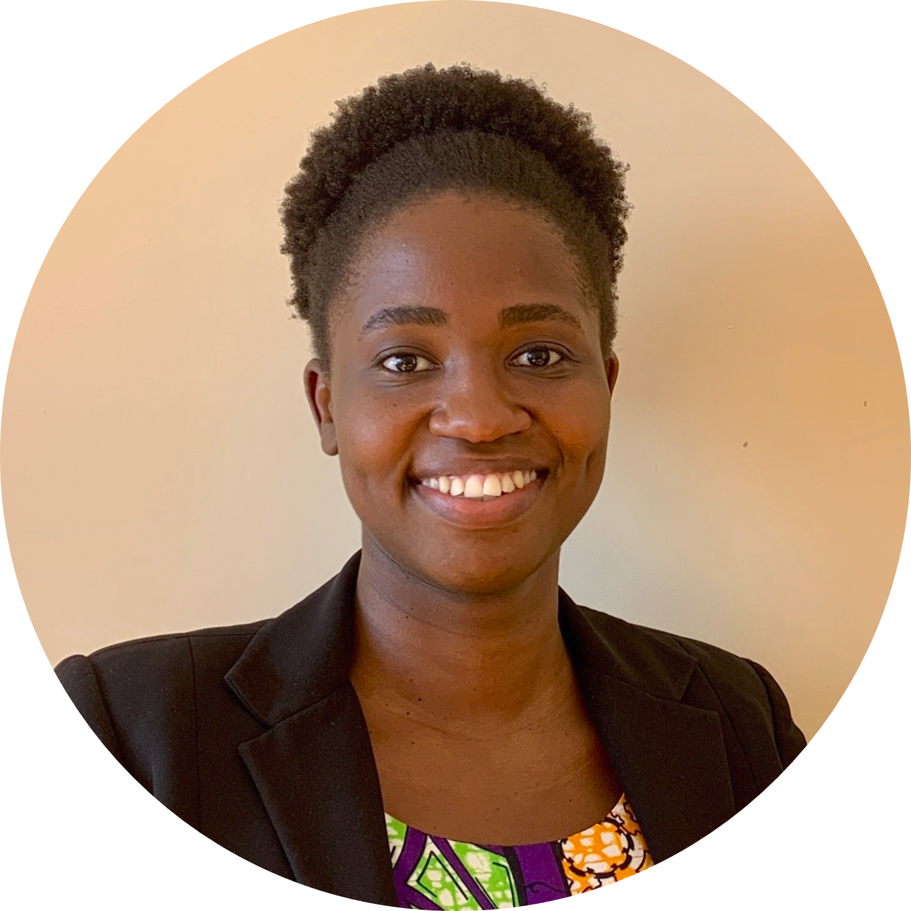
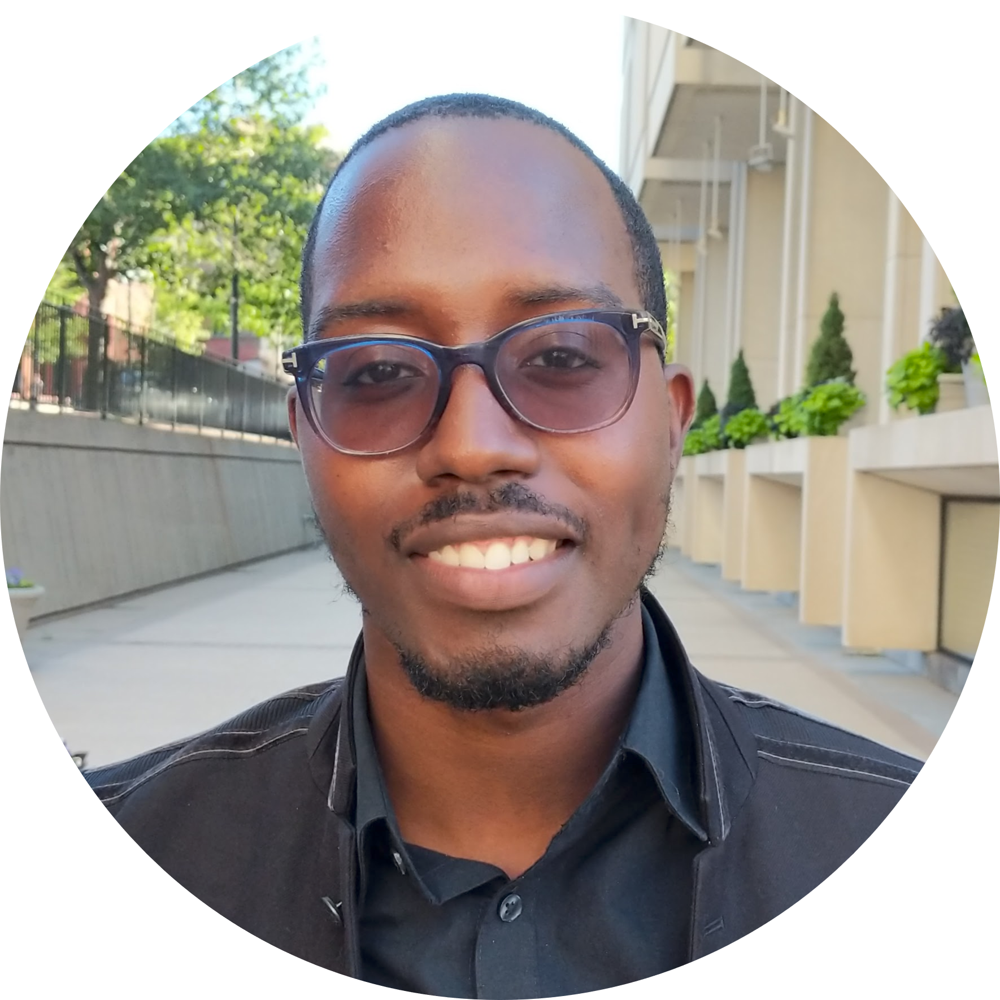
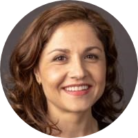

---
title:
output:
  html_document:
    df_print: paged
---

## **Our Team**

 

 

&nbsp;

#### **Maddie Stoms**
Maddie is a second year PhD student in the department of Biostatistics. She is interested in functional data, personalized medicine, and the intersection of data and decision making. As a devout people-person, she spends most of her time cooking for, road-tripping with, and explaining p-values to the people she loves.   
Contact: ms5975@cumc.columbia.edu

&nbsp;

 

&nbsp;

#### **Charly Fowler**
Charly is a second year PhD student in the department of Biostatistics. Her research interests include causal inference, missing data, mental health, and health disparities. She is currently investigating statistical methods to account for missing data in time series with applications to mobile health studies. When not working, she enjoys cooking, hiking, and playing with her cat.   
Contact: crf2147@cumc.columbia.edu

&nbsp;

 

&nbsp;

#### **Muhire Honorine Kwizera**
Muhire is a Biostatistics PhD candidate at Columbia University. She is fascinated by anything data, and she has worked on various projects in biostatistical methods, brain imaging, time series, spatiotemporal analysis, bayesian statistics, and measurement error. In her free time, Muhire enjoys singing in a choir, taking walks, and meeting up with friends.   
Contact: mhk2159@cumc.columbia.edu

&nbsp;

 

&nbsp;

#### **Steven Lawrence**
Steven is currently a second year Masters student in the Biostatistics program at Columbia University. Being introduced to disparities analytics while volunteering at Mount Sinai, Steven has developed a passion for working with time series data, making visualizations and consulting. He is also a research assistant at the Center for Scientific Diversity. His goal is to contribute to diversity by helping to educate the next generation of underrepresented minorities in STEM.  
Contact: sl4269@cumc.columbia.edu

&nbsp;

 

&nbsp;

#### **Cody Chiuzan, PhD**
Dr. Chiuzan is an Assistant Professor in the Department of Biostatistics at Mailman. She is also affiliated with the Herbert Irving Comprehensive Cancer Center where she serves as the principal statistician on several multi-center oncology trials. Her research area focuses on development of early phase clinical trial designs nd leveraging real-world evidence to improve trial outcomes. For the last two years, Cody has served as the Chair and Co-Chair of the Diversity Committee (Department of Biostatics) and as President of the American Statistical Association (ASA) NYC Chapter.  
Contact: cc3780@cumc.columbia.edu

&nbsp;

&nbsp;

 

