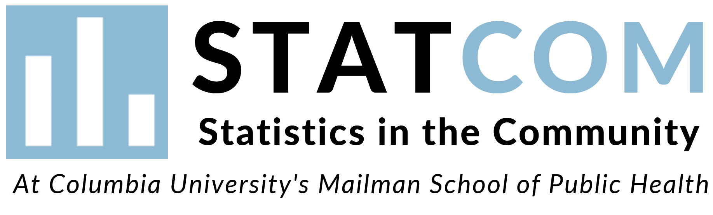

---
output:
  html_document:
    df_print: paged
---

   

  

 

 

#### **Our Mission** 

STATCOM is a community outreach program provided to New York City by graduate students in the Department of Biostatistics at Mailman School of Public Health. We offer professional statistical consulting, free of charge, to non-profit community and local governmental groups in the areas of data organization, analysis, and interpretation. 

#### **Our History**

The first STATCOM Chapter was founded in 2001 at Purdue University’s Department of Statistics with support from a Member Initiatives Grant from the American Statistical Association (ASA). Since then a network of STATCOM programs has been established and active chapters are housed in statistics and Biostatistics departments throughout the country. The Columbia University chapter was founded in 2021 by Biostatistics students [Maddie Stoms](https://www.linkedin.com/in/madison-stoms-597155127/), [Charly Fowler](https://www.linkedin.com/in/charlotte-fowler-2a86b71a0/), [Steven Lawrence](www.sl4269.github.io), and [Muhire Kwizera](https://www.linkedin.com/in/muhire-honorine-kwizera-96253583/) with the help of faculty advisor [Cody Chiuzan](https://www.publichealth.columbia.edu/people/our-faculty/cc3780). 

#### **Our Vision**
The STATCOM team is committed to leveraging our expertise for the betterment of local organizations and, consequently, the welfare of our community. We are passionate about using data to inform decisions and desire to engage in high-impact research with community advocates.

 

***Thank you for your interest in STATCOM. We would love to know how we can partner with you in your mission!***

&nbsp;

 

 

