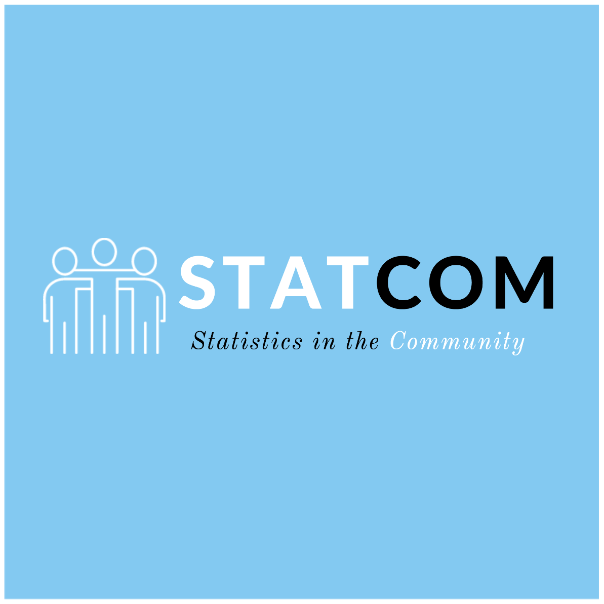

---
title: STATCOM - Columbia Biostatistics 
output:
  html_document:
    df_print: paged
---

 

STATCOM is a community outreach program provided to New York City by graduate students in the Department of Biostatistics at Mailman School of Public Health. We offer professional statistical con-sulting, free of charge, to non-profit community and local governmental groups in the areas of data or-ganization, analysis, and interpretation. Through participation students benefit by gaining hand on experience while providing service to our local community. 

STATCOM is lead by Columbia Biostatistics students [Maddie Stoms](https://www.linkedin.com/in/madison-stoms-597155127/), [Charly Fowler](https://www.linkedin.com/in/charlotte-fowler-2a86b71a0/), [Steven Lawrence](www.sl4269.github.io), and [Muhire Kwizera](https://www.linkedin.com/in/muhire-honorine-kwizera-96253583/) with the help of faculty advisor [Cody Chiuzan](https://www.publichealth.columbia.edu/people/our-faculty/cc3780). 

&nbsp;

&nbsp;

&nbsp;

### Services provided by STATCOM

* Survey/sample design and analysis

* Graphical and statistical methods of summarizing and presenting data

* Interpretation of survey results

* Development of statistical models

* Trend analysis and more

STATCOM is able to assist in areas of study design, analysis, and the interpretation of results; however, we do not have the resources to assist in data collection and entry.

